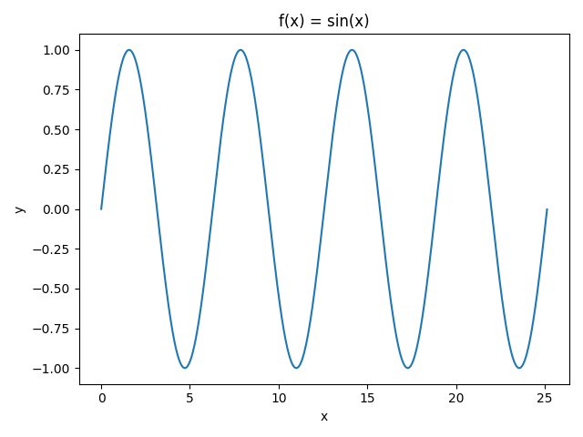
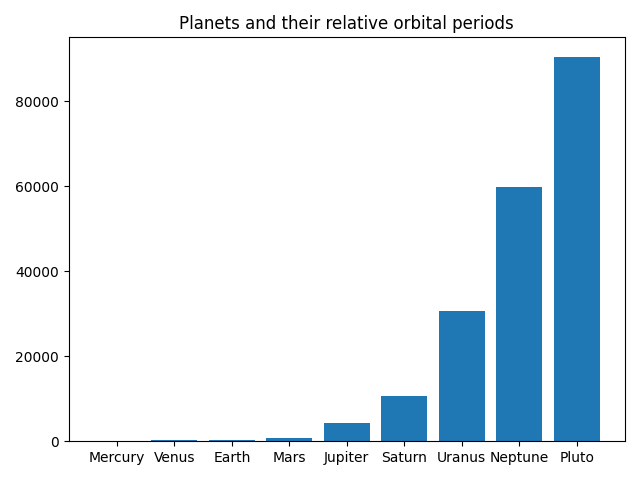
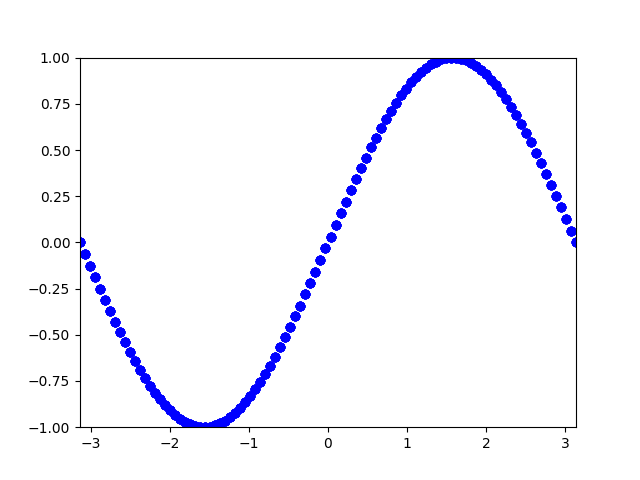
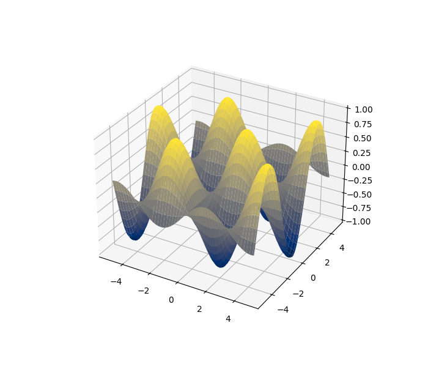
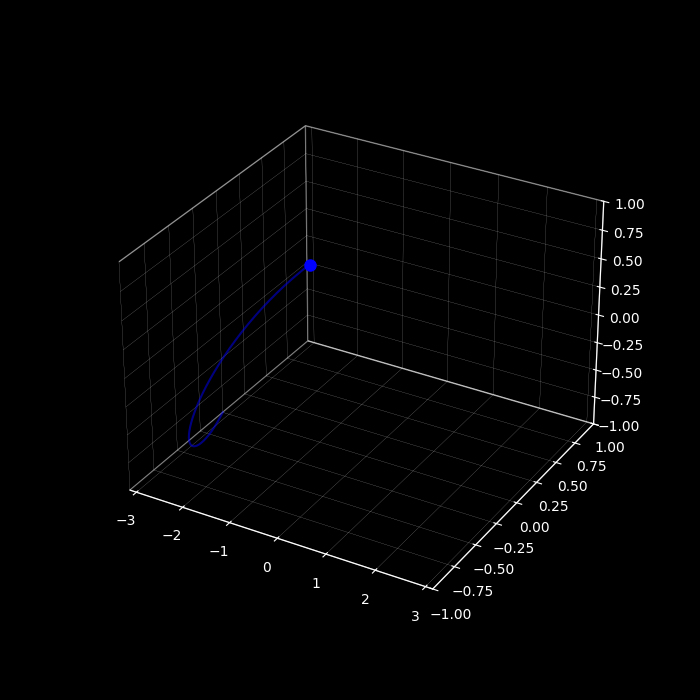

# Matplotlib Graphing with functions

This is a small project going over the basics of graphing through the use of matplotlib and numpy

-----

## Graphs 
### linear_graph.py
- f(x) = sin(x)


- bar chart of data taken from open source NASA dataset


- animated graph of f(x) = sin(x) moving from x = 0 to x = pi


-------
### 3d_graph.py
- 3D graph of f(x,y) = sin(x)cos(y) with colormap


------
### particle_motion.py
- Animated motion of particle moving the path: x = t, y = sin(t), z = cos(t) from t \in (-pi, pi)


------

## Interact with/observe animation of graphs
````bash
git clone https://github.com/koisoysauce/graphing-basics.git
cd graphing-basics
python (file_name)
````
